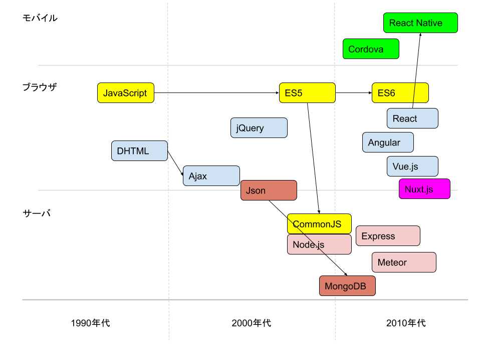

# JavaScript ~ React

---

## 目次

1. JavaScriptとは
1. 代表的なモジュール
1. Reactとは
1. おすすめエディタVisual Studio Code
1. Node.jsの環境設定
1. MapboxGL.js
1. 宿題

---

# JavaScriptとは

---

## 概要

Webブラウザ上で動作することを目的として開発されたプログラミング言語。もともとはWebブラウザ上でのみ動くことを目的としていたが、他の様々な場面でも動作するように拡張されていった。

---



## 誕生

それまでWebブラウザでは静的なHTMLしかレンダリングすることができなかったが、JavaScriptを導入することで動きのあるWebページを作れるようになった。

---

## 発展

googleやAmazonがWebサービスにJavaScriptを導入し始め、その過程で生まれたAjax(Asynchronous JavaScript and XML)という技術がきっかけでWebアプリケーションになくてはならない技術要素となった。

## Node.jsの台頭

WebブラウザChromeに搭載されたJavaScriptエンジンをベースに、HTTPサーバに必要なモジュールを追加したNode.jsが2009年に作成され、Webアプリケーションのサーバ側でもJavaScriptを選択することが可能となった。

---

## Apache cordovaによるモバイル開発

HTML、CSS、JavaScriptによりAndroid、iPhoneのクロスプラットフォーム開発が可能なApache cordovaが開発された。

## SPA(Single Page Application)

ページ遷移をせずに、JavaScriptの非同期通信でデータを受け取り、JavaScriptによりDOMを直接変更しレンダリングすることで、画面の表示を切り替える手法。

---

#  JavaScriptのバージョン

---

## バージョン履歴

JavaScriptは、ECMA Internationalという組織で規格の標準化（ECMA Script）が行われている。ECMA Scriptのバージョン履歴は以下。

| バージョン | リリース | 備考 |
| :--- | :--- | :--- |
| 1 | 1997年6月 | |
| 2 | 1998年6月 | | 
| 3 | 1999年12月 | |
| 4 | 放棄 | |
| 5 | 2009年12月 | |
| 5.1 | 2011年6月 | いわゆるES5 |

---

| バージョン | リリース | 備考 |
| :--- | :--- | :--- |
| 6 (ES2015) | 2015年6月 | |
| 2016 | 2016年6月 | |
| 2017 | 2017年7月 | いわゆるES6 |
| 2018 | 策定中 |

現在もバージョンアップが進められているが、代表的なバージョンについて説明する。

---

## ES5(ECMA Script Version5)
Version5は2009年にリリースされ5.1が2011年にリリースされた。主なブラウザは本バージョンの仕様にほぼ100％対応しており、Version5で記述されたJavaScriptはそのままブラウザで実行可能。

おそらく皆さんが知っているJavaScriptはこれ。

---

例）
```JavaScript
for( ; ; ) {
  window.alert(
      "　∧_∧　ババババ\n" +
      "（ ・ω・)=つ≡つ\n" +
      "（っ ≡つ=つ\n" +
      "`/　　)\n" +
      "(ノΠＵ\n" +
      "何回閉じても無駄ですよ～ww\nm9（＾Д＾）プギャー！！");
}
```
あの世間を騒がせた無限アラートもES5。
上記コードを使用すると逮捕されるので注意！

---

## ES6(ECMA Script Version6)
Version6は2015年にリリースされた。そのためES2015とも言う。Version6はリリースから期間が経っているので、主なブラウザは本バージョンの仕様の多くに対応している。しかし、一般的に「ES6（ES2015）で開発する」という場合、ES6以降（ES2016、ES2017）を含んでいるため、ES6のJavaScriptで開発されたものはそのままではブラウザで動作しない。

---

例）
```JavaScript
class User extends Model {
  const salt = 'passwordSalt';
  constructor(params) {
    super(params);
    this.name = params.name;
    this.password = this.encrypt(params.password);
  }

  const encrypt = word => {
    if(!word) return null;
    return `${this.constructor.salt}--${word}`.encrypt();
  }
}
```
class記法が使えるようになったことが一番わかりやすい特徴。そのほか、上記にあるアロー関数やテンプレート文字列など様々な仕様を盛り込んでいる。

---

## CommonJS
サーバサイドで動作するJavaScriptの仕様を定める目的でECMA Scriptとは別に立ち上げられたJavaScriptの仕様。Node.jsはCommonJSの仕様に則って動く。2009年に立ち上げられたことから、その内容は≒ES5と考えてだいたい間違いない。
つまり、Node.jsもES6では動かない部分がある。

---

例）
```JavaScript
const express = require('express');
　：
　：
```

モジュールシステムが追加されたことが最大の特徴。これにより、便利な部品がnpm moduleとして多数公開され、JavaScriptの開発環境を大きく変えていった。
なお、ES6にもモジュールシステムがあるがES6では記法が少し異なる。

公開されたモジュールを使用したい場合は、以下の1コマンドでインストールできる。
```shell
# npm install express
または
# yarn add express
```

あるいは、unpkg.comというCDNサービスを使ってHTMLからモジュールを参照することができる。

```html
<script src="https://unpkg.com/express" />
```

---

# 代表的なモジュール

---

## トランスパイラ

ES6以降で開発されたJavaScriptのプログラムは、Node.jsでもブラウザでも動作しない仕様がある。そのため、ES6のコードをNode.jsやブラウザで動作するCommonJS・ES5の記述に変換させる必要がある。この変換をトランスパイルと呼び、トランスパイルを行うモジュールをトランスパイラと呼ぶ。

代表的なトランスパイラ
* babel

---

## モジュールバンドラ

CommonJS・ES6で開発されたプログラムは、他のモジュールを利用することが一般的で、他のプログラミング言語のように1つの処理を実現するのに多数の分割されたプログラムファイルが必要となる。

JavaScriptの場合、プログラムファイルをクライアントに転送してクライアント側で動作させるため、ファイル数が多いと通信時間が多くかかる。それを解消するため、分割されたファイルを1つにまとめるモジュールが作られ、それをモジュールバンドラという。

代表的なモジュールバンドラ
* webpack
* Parcel

[googleトレンド](https://trends.google.co.jp/trends/explore?geo=JP&q=webpack,Parcel)

モジュールバンドラは1つにまとめるだけでなく、Scriptのminify(変数名を1文字にするなどしてコードのサイズを最小化する処理)や、難読化なども行うことができる。

---

## Webフレームワーク

Node.jsはWebサーバに必要なモジュールが追加されたものではあるが、基礎的なモジュールが多く、Node.jsだけではWebサーバをたてるのは非効率。そのため、Node.jsの上にもう1つフレームワークを採用するのが一般的。

代表的なwebフレームワーク
* Express
* Meteor
* Sails.js
* Backbone.js
* Nuxt.js

Expressが一般的すぎる単語のためgoogleトレンドはうまく取れず。。。
感覚的にはExpressが代表的でMeteorが最近人気が出てきているという感じ。

---

## フロントエンドライブラリ

webブラウザ上で表示の切り替え、画面遷移などのコーディングをわかりやすく簡単にできるようにしたライブラリ。最近のフロントエンドライブラリは、コーディング時のメリットだけでなく、表示処理のスピードまで考慮したものも多い。

代表的なフロントエンドライブラリ
* jQuery
* Angular.js
* React
* Vue.js

[googleトレンド](https://trends.google.co.jp/trends/explore?geo=JP&q=jQuery,Angular,React,Vue)

---

## 一般的な組み合わせ

今の日本のJavaScript開発だと以下の組み合わせが多く採用される（と思う）。

ウェブサーバ
* Node.js + Express (+ babel)

フロントエンド
* React (+ webpack + babel) or create-react-app
* Vue.js (+ webpack + babel) or Nuxt.js

---

数年前にはMEANスタックなんて言葉も流行りました。

* Mongodb
* Express
* Angular.js
* Node.js

---

# Reactとは

---

## React

ReactはFacebookが公開したUI構築のためのJavaScriptライブラリ。もちろんFacebookに利用されている。

特徴
* コンポーネント指向
* コンポーネントが保持するデータを更新すると自動的に再描画
* VirtualDOMにより、変更があるコンポーネントだけを再描画することが可能
* jsxという独自シンタックスを使うことにより、表示処理を簡潔に記述

---

## コンポーネント指向とは

* システムを機能（何ができるのか）によって分離する設計技法
* コンポーネントを使用する際にはインタフェースを経由する
* 同一インタフェースのコンポーネントは置換可能
* コンポーネントを使いたければインタフェースだけを知ればよい。使う対象のコンポーネントのことを知る必要さえない。（それで想定通りに動くかどうかは別問題）
  
エアコンが冷房なのか暖房なのかがわからなくても、リモコンの電源ボタンを押すと動きます。

（コンポーネント：冷房・暖房、インタフェース：電源ボタン）

---

## Reactにおけるコンポーネント指向とは

すべてのコンポーネントはpropsという入力インタフェースと、render()という出力（画面表示）のインタフェース（というかメソッド）を持つ。

→インタフェースの統一

1つのコンポーネントにHTMLの枠組み、スタイルの指定、onClickなどの
アクションを包括することで、コンポーネントごとに見た目と動きからなる最小限の機能を持たせることができる。

→機能分離が可能

---

React以前のES5の記述だと1つのテキストインプットを用意するのに3ファイル必要

```html
<input id="test-text" class="short-text" type="text" value="default text" />
```

```css
input.short-text {
  width: 100px;
}
```

```Javascript
$("#test-text").on("blur", function(e){
  if(!checkValue(e.value())) {
    alert("ダメでーす");
    e.value = "";
  }
});
```

---

Reactなら1つのコンポーネントで足りる(以下はmaterialUIを活用した記述)

```jsx
const styles = makeStyle({
  root: {
    width: '100%'
  }
});
const TestText = props => {
  const [text, setText] = useState("default text");
  const classes = styles();
  const onBlur = (val) => {
    if(!checkValue(val)) {
      alert("ダメでーす");
      setText("");
    }
  }
  return <input type="text" className={classes.root} value={text} onBlur={(e) => onBlur(e.target.value)} />;
};
```

---

## jsx記法

Reactコンポーネントを返却するメソッドでは、returnステートメントにマークアップ記法を記述することができる。

```jsx
return <input type="text" className={classes.root} value={text} onBlur={(e) => onBlur(e.target.value)} />;
```

マークアップ記法の中で{}でくくると、その内部はJavascriptで解釈され実行結果がマークアップに取り込まれる。

---

## React Hello World!

```html
<html lang="jp">
<head>
  <meta charset="UTF-8">
</head>
<body>
  <section id="content" />
</body>
</html>
```

```jsx
import { react } from 'react';
import { reactDOM } from 'react-dom';

const Component = props => {
  return <div>Hello, World!</div>;
};

ReactDOM.render(<Component />, document.getElementById("content"))
```

---

# おすすめエディタVisual Studio Code

---

# Node.jsの環境設定

---

資料作るの力尽きたので、書きかけのQiitaを完成させました。
そちらで説明します。
[expressとreactで作るSPA(0) - 準備編](https://qiita.com/megmog/items/f48ecbbb30b7f1c06332)

コードは [github](https://github.com/m-megmog-m/sample_express_and_react)

---

# MapboxGL.js

---

# 宿題

---